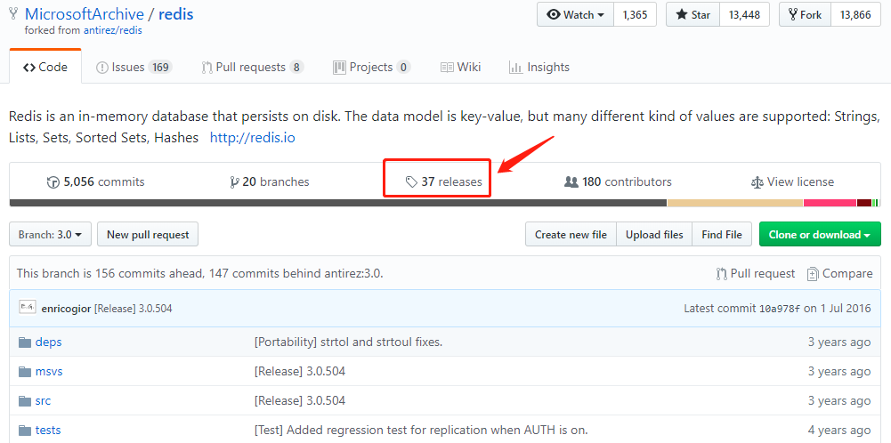
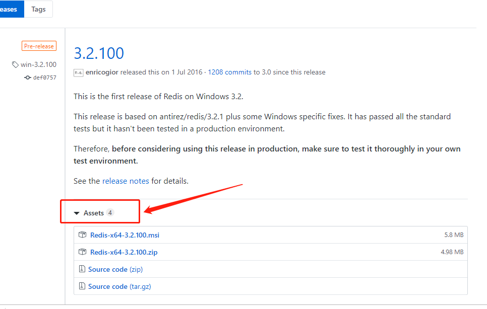

# redis 在ubuntu系统中的安装与启动
1.安装：
```shell
  sudo apt-get install redis-server
```
2.卸载
```shell
sudo apt-get purge --auto-remove redis-server
```
3.启动：redis安装后，默认会自动启动，可能通过下列命令查看：
```shell
ps aux|grep redis
```
如果想自己手动启动，要以通过以下命令进行启动：
```shell
sudo service redis-server start
```
4.带配置文件启动：  

4.1 window 版：
```
redis-server redis.windows.conf
```
4.2 linux 版：  

```shell
./redis-server /etc/redis/6379.conf
```

4.停止：
```shell
sudo service redis-server stop
```

# redis在windows安装
1. 要安装Redis，首先要获取安装包。
Windows的Redis安装包需要到以下GitHub链接找到。链接：https://github.com/MSOpenTech/redis。打开网站后，找到Release，点击前往下载页面。

> 进入后，再选择相应版本即可




# redis 客户端工具
## 1. redis-cli
> 语法

```shell
redis-cli -h host -p port -a password
# 如果没有密码，则：
redis-cli -h host -p port 
$ redis-cli -h 127.0.0.1 -p 6379
127.0.0.1:6379>keys * (获取所有键值)
```
## 2.Redis Desktop Manager
官网：https://redisdesktop.com/  
github: https://github.com/uglide/RedisDesktopManager  
下载，安装即可。


# redis 常用命令
>参考：https://www.cnblogs.com/melonjiang/p/5342505.html

## string操作
> redis中的String在在内存中按照一个name对应一个value来存储

1.set()
```shell
#在Redis中设置值，默认不存在则创建，存在则修改
set('name', 'zhangsan')
参数：
set(name, value, ex=None, px=None, nx=False, xx=False)
ex，过期时间（秒）
px，过期时间（毫秒）
nx，如果设置为True，则只有name不存在时，当前set操作才执行,同setnx(name, value)
xx，如果设置为True，则只有name存在时，当前set操作才执行 
```
## list 操作

## set 操作
> 特点：
>>1.无序的  
>>2.不允许重复

### 向集合中添加元素

```shell
$ redis-cli
127.0.0.1:6379> sadd team1 yaomin
(integer) 1
127.0.0.1:6379> sadd team1 kebi
(integer) 1
```
### 一次添加多个
````shell
127.0.0.1:6379> sadd team1 wangwu zhangsan
(integer) 2
````
### 获取对应集合的所有成员
>smember set_name
```shell
127.0.0.1:6379> smembers team1
1) "kebi"
2) "yaomin"
```
### 如果向集合中添加已存在的元素，则(返回0，添加失败,但不报错)：
```shell
127.0.0.1:6379> sadd team1 kebi
(integer) 0
```
### 删除对应的集合中的某些值
>srem set1 set1_value
```shell
127.0.0.1:6379> smembers team1
1) "kebi"
2) "yaomin"
127.0.0.1:6379> srem team1 yaomin
(integer) 1
127.0.0.1:6379> smembers team1
1) "kebi"
127.0.0.1:6379>
```
### 获取对应的集合中的元素个数
>scard 集合
```shell
127.0.0.1:6379> smembers team1
1) "kebi"
127.0.0.1:6379> scard team1
(integer) 1
```
### 返回两个数组的交集
> sinter set1 set2

```shell
127.0.0.1:6379> smembers team1
1) "kebi"
2) "zhangsan"
3) "wangwu"
4) "yaoming"
127.0.0.1:6379> sadd team2 yaoming
(integer) 1
127.0.0.1:6379> smembers team2
1) "yaoming"
127.0.0.1:6379> sinter team1 team2
127.0.0.1:6379> sinter team1 team2
1) "yaoming"
```
### 获取多个集合的并集
> sunion set1 set2 
```shell
127.0.0.1:6379> smembers team1
1) "kebi"
2) "zhangsan"
3) "wangwu"
4) "yaoming"
127.0.0.1:6379> smembers team2
1) "kebi"
2) "xiaoxi"
3) "wangwu"
4) "yaoming"
127.0.0.1:6379> sunion team1 team1
1) "yaoming"
2) "kebi"
3) "zhangsan"
4) "wangwu"
```
### 获取多个集合的差集
> sdiff set1 set2 (在第一个集合中，但不在第二个集合中的元素)
```shell
127.0.0.1:6379> smembers team1
1) "kebi"
2) "zhangsan"
3) "wangwu"
4) "yaoming"
127.0.0.1:6379> smembers team2
1) "kebi"
2) "xiaoxi"
3) "wangwu"
4) "yaoming"
127.0.0.1:6379> sdiff team1 team2
1) "zhangsan"
127.0.0.1:6379> sdiff team2 team1
1) "xiaoxi"
```
## hash 哈希操作
redis中的Hash 在内存中类似于一个name对应一个dic来存储  
hset(name, key, value)
### 1. 添加
```shell
127.0.0.1:6379> hset website baidu www.baidu.com
(integer) 1
127.0.0.1:6379> hset website google www.google.com
(integer) 1
```
### 2.查询
hget  
hgetall
```shell
127.0.0.1:6379> hget website baidu
"www.baidu.com"
127.0.0.1:6379> hgetall website
1) "baidu"
2) "www.baidu.com"
3) "google"
4) "www.google.com"
```
### 3.获取某个hash所有键
> hkeys 
 
```shell
127.0.0.1:6379> hkeys website
1) "baidu"
2) "google"
```
### 4.获取某个hash所有的值
```shell
127.0.0.1:6379> hvals website
1) "www.baidu.com"
2) "www.google.com"
```
### 5.删除某个hash中的field
```shell
127.0.0.1:6379> hgetall website
1) "baidu"
2) "www.baidu.com"
3) "google"
4) "www.google.com"
127.0.0.1:6379> hdel website baidu
(integer) 1
127.0.0.1:6379> hgetall website
1) "google"
2) "www.google.com"
```
### 6.判断hash中某个field是否存在
```shell
127.0.0.1:6379> hgetall website
1) "google"
2) "www.google.com"
127.0.0.1:6379> hexists website baidu
(integer) 0
127.0.0.1:6379> hexists website google
(integer) 1
```
### 7.获取hash中总共的键值对：
hlen field
```shell
127.0.0.1:6379> hgetall website
1) "google"
2) "www.google.com"
127.0.0.1:6379> hlen website
(integer) 1
127.0.0.1:6379> hset website 163 www.163.com
127.0.0.1:6379> hgetall website
1) "google"
2) "www.google.com"
3) "163"
4) "www.163.com"
127.0.0.1:6379> hlen website
(integer) 2
```


