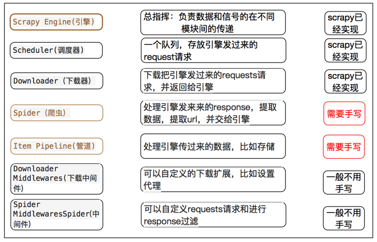
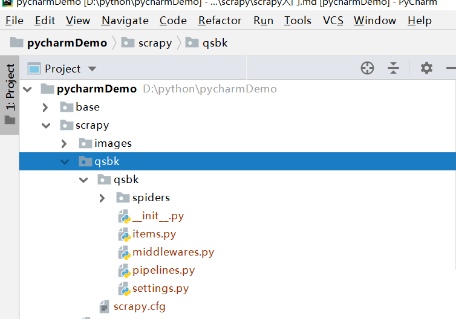

# Scrapy 框架

## 1. scrapy 简介

> Scrapy是用纯Python实现一个为了爬取网站数据、提取结构性数据而编写的应用框架，用途非常广泛。

> 框架的力量，用户只需要定制开发几个模块就可以轻松的实现一个爬虫，用来抓取网页内容以及各种图片，非常之方便。

> Scrapy 使用了 Twisted`['twɪstɪd]`(其主要对手是Tornado)异步网络框架来处理网络通讯，可以加快我们的下载速度，不用自己去实现异步框架，并且包含了各种中间件接口，可以灵活的完成各种需求。

## 2. scrapy 框架模块功能 (绿线是数据流向)


### 2.1 Scrapy Engine(引擎): 
- 负责Spider、ItemPipeline、Downloader、Scheduler中间的通讯，信号、数据传递等。

### 2.2 Scheduler(调度器): 
- 它负责接受(收)引擎发送过来的Request请求，并按照一定的方式进行**整理排列，入队**，当引擎需要时，交还给引擎。

### 2.3 Downloader（下载器）：
- 负责下载Scrapy Engine(引擎)发送的所有Requests请求，并将其获取到的Responses交还给Scrapy Engine(引擎)，由引擎交给Spider来处理，

### 2.4 Spider（爬虫）：
- 它负责处理所有Responses,从中分析提取数据，获取Item字段需要的数据，并将需要跟进的URL提交给引擎，再次进入Scheduler(调度器)，

### 2.5 Item Pipeline(管道)：
- 它负责处理Spider中获取到的Item，并进行进行后期处理（详细分析、过滤、存储等）的地方.

### 2.6 Downloader Middlewares（下载中间件）：
- 你可以当作是一个可以自定义扩展下载功能的组件。

### 2.7 Spider Middlewares（Spider中间件）：
- 你可以理解为是一个可以自定扩展和操作引擎和Spider中间通信的功能组件（比如进入Spider的Responses;和从Spider出去的Requests）
> scrapy框架运行顺序

> 框架中各组件know more
scrapy_know_more.png

###制作 **Scrapy 爬虫 一共需要4步**：
1. 新建项目 (scrapy startproject xxx)：新建一个新的爬虫项目
2. 明确目标 （编写items.py）：明确你想要抓取的目标[字段] 
3. 制作爬虫 （spiders/xxspider.py）：制作爬虫开始爬取网页
4. 存储内容 （pipelines.py）：设计管道存储爬取内容 
> 解析：2 明解目标items.py
```python
# items.py
import scrapy
class ScrapyTestItem(scrapy.Item):
    # 书名
    title = scrapy.Field()
    # 作者
    author = scrapy.Field()
    # 简介
    abstract = scrapy.Field()
```

## 3.Scrapy的安装介绍
- 方法一：通过pip 安装 Scrapy 框架pip install Scrapy
- 方法二：强烈建议用Anaconda安装 
```shell
conda install -c conda-forge scrapy
```
## 4.入门案例
- 学习目标:
1. 创建一个Scrapy项目
2. 定义提取的结构化数据(Item)
3. 编写爬取网站的 Spider 并提取出结构化数据(Item)
4. 编写 Item Pipelines 来存储提取到的Item(即结构化数据)
### 4.1 新建项目(scrapy startproject)
- 在开始爬取之前，必须创建一个新的Scrapy项目。进入自定义的项目目录中，运行下列命令：
```
D:\python\pycharmDemo\scrapy>scrapy startproject qsbk
```
- 其中， qsbk 为项目名称，可以看到将会创建一个 qsbk 文件夹，目录结构大致如下：<br/>

- 下面来简单介绍一下各个主要文件的作用：
```python
#scrapy.cfg ：项目的配置文件
#
#qsbk/ ：项目的Python模块，将会从这里引用代码
#
#qsbk/items.py ：项目的目标文件
#
#qsbk/pipelines.py ：项目的管道文件
#
#qsbk/settings.py ：项目的设置文件
#
#qsbk/spiders/ ：存储爬虫代码目录
```
### 4.2 制作爬虫(scrapy genspider [爬虫名称] [域名])
> 在当前目录下输入命令，将在qsbk/spider目录下创建一个名为qsbk_spider的爬虫，并指定爬取域的范围：
> (域名不用加www)
```shell
scrapy genspider qsbk "qiushibaike.com"
```
> 打开 qsbk/spider目录里的 qsbk_spider.py，默认增加了下列代码:
```python
# -*- coding: utf-8 -*-
import scrapy


class QsbkSpiderSpider(scrapy.Spider):
    name = 'qsbk_spider'
    allowed_domains = ['qiushibaike.com']
    start_urls = ['http://qiushibaike.com/']

    def parse(self, response):
        pass

```

### 4.3运行爬虫
```shell
# scrapy crawl [爬虫名称]
scrapy crawl qsbk_spider
```