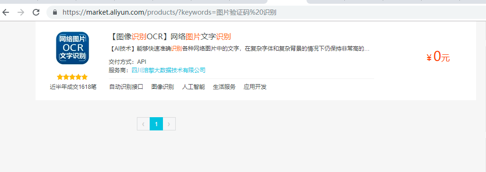

# tesseract  OCR 图片识别使用 （仅用于像OA这类简单的图片识别）
## 参考URL
 https://blog.csdn.net/showgea/article/details/82656515
## 使用版本3.02 （使用新版似乎更不好用，大家可以试试）

# 使用阿里云市场的付费工具
https://market.aliyun.com/

## 图片识别码工具（测试过好用）



参考代码：alibaba_ocr.py

