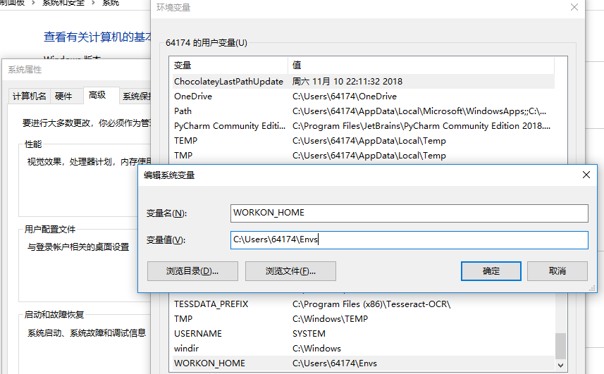
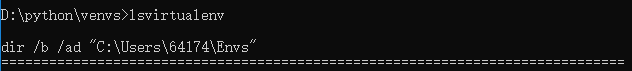
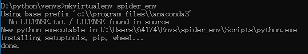
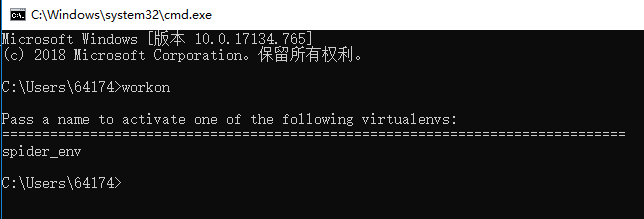
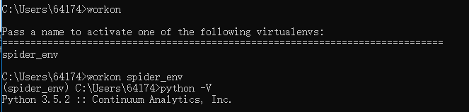
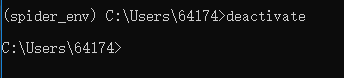

# python 创建虚拟环境--virtualenv

## 1.什么是虚拟环境
Python虚拟环境的主要目的是为了给不同的工程创建互相独立的运行环境。在虚拟环境下，每一个工程都有自己的依赖包，而与其它的工程无关。不同的虚拟环境中同一个包可以有不同的版本。并且，虚拟环境的数量没有限制，我们可以轻松地用virtualenv或者pyenv等工具来创建多个虚拟环境。
>在实际项目开发中，我们通常会根据自己的需求去下载各种相应的框架库，如Scrapy、Beautiful Soup等，但是可能每个项目使用的框架库并不一样，或使用框架的版本不一样，这样需要我们根据需求不断的更新或卸载相应的库。直接怼我们的Python环境操作会让我们的开发环境和项目造成很多不必要的麻烦，管理也相当混乱。如一下场景：

>>场景1：项目A需要某个框架1.0版本，项目B需要这个库的2.0版本。如果没有安装虚拟环境，那么当你使用这两个项目时，你就需要 来回 的卸载安装了，这样很容易就给你的项目带来莫名的错误；

>>场景2：公司之前的项目需要python2.7环境下运行，而你接手的项目需要在python3环境中运行，想想就应该知道，如果不使用虚拟环境，这这两个项目可能无法同时使用，使用python3则公司之前的项目可能无法运行，反正则新项目运行有麻烦。而如果虚拟环境可以分别为这两个项目配置不同的运行环境，这样两个项目就可以同时运行。

## 2.创建虚拟环境

```dtd
注解 从 Python 3.6 开始，不推荐使用 pyvenv 脚本，
而是使用 python3 -m venv 来帮助防止任何关于虚拟环境将基于哪个 Python 解释器的混淆。
```
### 2.1 方法一：通过执行 venv 指令来创建一个 虚拟环境:
```shell
# 2.1.1 创建
python3 -m venv /path/to/new/virtual/environment
# 2.1.2 激活虚拟环境
进入第一步中创建的目录，运行activate.bat文件
Scripts\activate.bat
```
### 2.2 方法二（建议使用此方法）：

#### 2.2.1 安装virtualenv模块
cmd终端运行 ` pip install virtualenv `
#### 2.2.2 继续使用pip安装virtualenvwrapper-win
`pip install virtualenvwrapper-win`
#### 2.2.3 配置windows环境变量
新建系统变量，变量名为 WORKON_HOME，路径可以自行选择
（本人使用路径`C:\Users\64174\Envs`）


#### 2.2.4 检查虚拟环境配置是否成功
打开 cmd 输入 lsvirtualenv，就可以查看虚拟环境所存在的目录  


#### 2.2.5 创建虚拟环境
使用命令mkvirtualenv spider_env（这个虚拟环境名称可以随意起），
创建成功后直接进入虚拟环境spider_env  


#### 2.2.6 使用 workon 查看已存在的虚拟环境
`workon`  

#### 2.2.7 切换到某个虚拟环境
`workon spider_evn`  


#### 2.2.8 输入deactivate 退出虚拟环境
`deactivate`  



